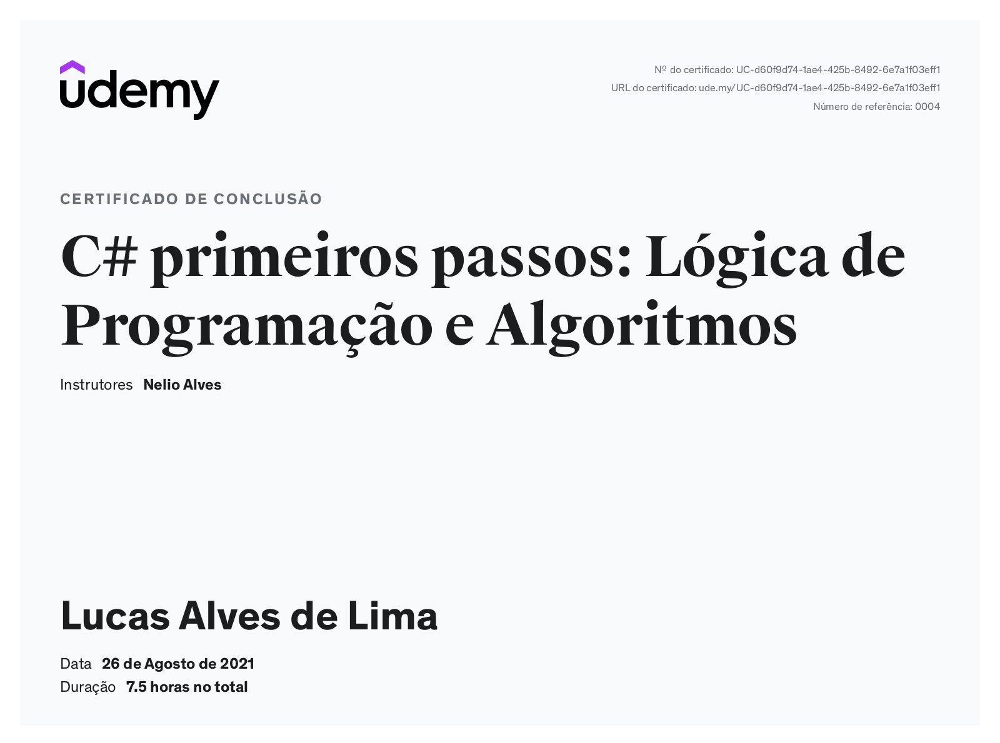
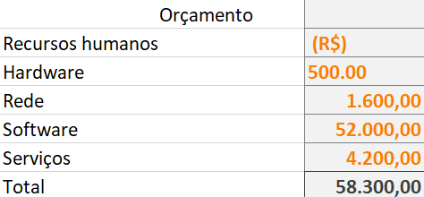

# Especificações do Projeto

# Personas 
* Gabriel Chaves 

Idealizador e Administrador da ONG (Logística), 29 anos

Gabriel, homem de 30 anos, classe média, brasileiro, mora em Guarulhos, São Paulo. Gosta de animais, de música, ficar com a família e amigos. Formado em Logística, atuou por muitos anos como Analista de Projetos em uma multinacional empresa varejista.
Aos 22 anos, no ano de 2013 adotou seu primeiro animal, um cachorro. Após a adoção, passou a vivenciar diversas situações em uma comunidade onde ajudava como, por exemplo, dar carona para que pessoas levassem seus animais para castração. Nesta vivência, acabou percebendo a quantidade de animais sem moradia e decidiu usar a garagem da sua casa como abrigo para alguns animais, deixando seu próprio carro para fora. Com a pandemia e o desligamento de seu  trabalho, Gabriel acabou se dedicando mais à ONG, que consequentemente cresceu com o apoio de uma rede de parceiros e com doações de voluntários. Dessa forma vem ajudando muitos animais a se recuperarem e a conseguir um novo lar através de um “reality show” de animais resgatados e com suas histórias divulgadas através do Instagram da ONG no endereço @casadoviralata.

* Renata Pereira da Silva

Comerciante, 55 anos

Renata, mulher de 55 anos, classe média, brasileira, mora em Guarulhos, São Paulo. Gosta de atividades ao ar livre, subir em pés de árvores frutíferas, pescar, andar a cavalo, nadar em rios. 
Formada em Administração, é comerciária e proprietária da Rações Renata com 6 unidades em Guarulhos, é apoiadora da ONG e fornece rações e diversos itens a preço de custo.
Desejo passar mais tempo junto às filhas e aproveitar mais os amigos.

* Kelly Aparecida de Assunção

Veterinária, 42 anos

Kelly, mulher de 42 anos, classe média, brasileira, mora na zona rural de Guarulhos, São Paulo. Gosta de estar com a família, dançar e conversar. Formada em Veterinária, é administradora e veterinária na Clínica Veterinária Guarulhos, parceira e apoiadora da ONG Casa do Vira Lata, contribui com atendimentos de urgência e cobra apenas pelos insumos e medicamentos utilizados nos atendimentos.
Deseja trocar de carro, finalizar a construção de sua casa e permanecer contribuindo com a ONG.

* Rafael Augusto Santos Lopes

Apoiador (Professor para a Educação Infantil), 36 anos

Rafael, homem de 36 anos, classe média, brasileiro, mora em Belo Horizonte, Minas Gerais. Gosta de viajar, de música e de ficar com a família e os amigos. Formado em Geografia e Análise Ambiental, Pedagogia e estudante de Análise e Desenvolvimento de Sistemas. 
Contribui mensalmente com a ONG por meio de pix. Deseja se recolocar no mercado em uma nova área, ser mais ousado nos projetos de vida, ter sua casa própria e viajar o quanto conseguir.

* Maria Helena Bonifácio

Apoiadora, Professora, 68 anos

Maria Helena, mulher de 68 anos, classe média, brasileira, mora no Maricá, Rio de Janeiro. 
Gosta de estar sempre trabalhando e ocupando sua mente. Curte caminhadas longas e cuidar de sua saúde física e mental.  Contribui mensalmente com a ONG através de envio de pix.

* Paulo Henrique Cabral dos Santos

Gestor de Mídias Sociais, 45 anos

Paulo, homem de 45 anos, classe média, brasileiro, mora em São Paulo, capital. Gosta de estar com a família, tocar guitarra e esportes diversos. 
Possui graduação em Análise e Desenvolvimento de sistemas e especialização mídias sociais. É parceiro da ONG, responsável pelo gerenciamento das mídias sociais. 

* Wagner Siqueira

Apoiador, transporte, 50 anos

Wagner, homem de 50 anos, classe média, brasileiro, mora em Guarulhos, São Paulo. Gosta de viajar, colecionar moedas internacionais, jogar xadrez online e praticar esportes ao ar livre.
Possui graduação em Logística e é pós-graduado em Gestão de Pessoas. Na ONG contribui eventualmente com o transporte de animais.

## Histórias de Usuários

Com base na análise das personas foram identificadas as seguintes histórias de usuários:

|EU COMO... `PERSONA`| QUERO/PRECISO ... `FUNCIONALIDADE` |PARA ... `MOTIVO/VALOR`                 |
|--------------------|------------------------------------|----------------------------------------|
|Gabriel Chaves  | Cadastros de animais resgatados           | Logística de animais baseado na disponibilidade               |
|Gabriel Chaves       | Cadastro e Gerência de pessoas                 | Para ver/cadastrar pessoas interessadas em adotar animais |
|Gabriel Chaves  | Criar uma ferramenta para selecionar  os animais           | O interessado adotar animais de acordo com a sua carta de intenção;               |
|Gabriel Chaves       | Gerar um número de protocolo para cada candidatura                 | Número de protocolo para controle e identificação de prioridade de acordo com perfis |
|Kelly Aparecida de Assunção  | Status de saúde dos animais no aplicativo           | Ter ciência da saúde do animal, como data de vacinação, possíveis internações ou quaisquer outras eventualidades               |
|Maria Helena Bonifácio       | Status da Clínica                 | Para acompanhar a evolução da clínica e suas  necessidades, podendo assim fazer contribuições pontuais |
|Rafael Augusto Lopes | Sistema de fotos e identificação do animal interessado           | Não esquecer de fazê-las               |

### Análise da Situação Atual

Apresente aqui os problemas existentes que viabilizam (seria "inviabilizam"??) sua proposta. Apresente o modelo do sistema como ele funciona hoje. Caso sua proposta seja inovadora e não existam processos claramente definidos, apresente como as tarefas que o seu sistema pretende implementar são executadas atualmente, mesmo que não se utilize tecnologia computacional. 

### Descrição Geral da Proposta

O projeto se dá com a possibilidade de cadastros e acompanhamentos em tempo real das intenções de adoção dos cães e gatos da Casa do Vira-Lata. A aplicação propiciará uma interação fluida e assertiva de modo a organizar e atender as dinâmicas do processo de adoção. Pretende-se programar para que as imagens dos animais passem pela tela do usuário com a possibilidade de um like ou dislike, e dessa forma um banco de animais para possívei adoção será criado. A futura família adotante poderá então escolher dentre os animais que ela previamente selecionou e se candidatar para a adoção de um ou mais destes. Em sequência registrará na aplicação a sua carta de intenção explicitando sobre os pré-requisitos sugeridos pela ONG.

### Processo 1 – Seleção de um animal pelo usuário

### Processo 2 – Decisão e entrada do processo de adoção

## Indicadores de Desempenho

## Requisitos

As tabelas que se seguem apresentam os requisitos funcionais e não funcionais que detalham o escopo do projeto. 

# Requisitos Funcionais:

| ID | Requisito | Especificação |
| -- | --------- | ------------- |
| 1 | Incluir/Excluir/Alterar informações de um pet | Permite o administrador gerenciar todas informações como foto, nome, idade estimada e porte do animal; |
| 2 | Incluir/Excluir/Alterar informações de um usuário | Permite os usuários a gerenciar suas informações pessoais;  |
| 3 | Geração de um relatório do candidato a adoção | Permite o administrador gerar todo um relatórios com as informações e requisitos de um usuário para verificar se ele se encaixa no perfil do pet |
| 4 | Gerar meio de comunicação com um candidato específico  | Permite que o usuário ou até mesmo o administrador inicie um chat de comunicação para realizar um filtro e garantir que o animal vá e viva em um lugar seguro |
| 5 | Gerar relatório final a respeito do status da adoção | Gera relatório final sobre a adoção, um documento com todas informações sobre o animal adotado e sua nova família; |

# Requisitos não funcionais:

| ID | Requisito | Especificação |
| -- | --------- | ------------- |
| 1 | Autenticação de login Usuário; | Ao abrir o app, os usuários devem passar por uma autenticação por usuário e senha para aumentar a segurança de seus dados pessoais |
| 2 | Tempo de acesso ao app; | O app deverá ter um tempo de acesso rápido, com no máximo 25 segundos de carregamento de interface; |
| 3 | Ambiente de fácil uso; | O app tem o objetivo de ser de um uso extremamente intuitivo, facilitando a vida do usuário e administrador; |
| 4 | Proteção a erros de usuários; | A aplicação vai ter um comprometimento de evitar e alertar todos os maus usos de usuários; |
| 5 | Estética da interface | Interface será muito prática, intuitiva e responsiva, o objetivo principal é fazer algo clean de fácil uso; |

# Restrições

O projeto está restrito pelos itens apresentados na tabela a seguir.

|ID| Restrição                                             |
|--|-------------------------------------------------------|
|01| O projeto deverá ser entregue até o final do semestre |
|02| Não pode ser desenvolvido um módulo de backend        |

## Diagrama de Casos de Uso

O diagrama de casos de uso é o próximo passo após a elicitação de requisitos, que utiliza um modelo gráfico e uma tabela com as descrições sucintas dos casos de uso e dos atores. Ele contempla a fronteira do sistema e o detalhamento dos requisitos funcionais com a indicação dos atores, casos de uso e seus relacionamentos. 

As referências abaixo irão auxiliá-lo na geração do artefato “Diagrama de Casos de Uso”.

> **Links Úteis**:
> - [Criando Casos de Uso](https://www.ibm.com/docs/pt-br/elm/6.0?topic=requirements-creating-use-cases)
> - [Como Criar Diagrama de Caso de Uso: Tutorial Passo a Passo](https://gitmind.com/pt/fazer-diagrama-de-caso-uso.html/)
> - [Lucidchart](https://www.lucidchart.com/)
> - [Astah](https://astah.net/)
> - [Diagrams](https://app.diagrams.net/)

# Matriz de Rastreabilidade

Matriz de rastreabilidade de requisitos:

| Cód |  Prioridade | Descrição | Tipo | Solicitante | Status | Data conclusão |
|-----|-------------|-----------|------|-------------|--------|----------------|
| 1 |  Altíssima | Incluir/Excluir/Alterar informações de um pet | Funcional | Equipe | Pendente | Não concluído |
| 2 |  Altíssima | Incluir/Excluir/Alterar informações de um usuário | Funcional | Equipe | Pendente | Não concluído |
| 3 |  Alta | Geração de um relatório do candidato a adoção | Funcional | Equipe | Pendente | Não concluído |
| 4 |  Alta | Gerar meio de comunicação com um candidato específico | Funcional | Equipe | Pendente | Não concluído |
| 5 |  Média | Gerar relatório final a respeito do status da adoção | Funcional | Equipe | Pendente | Não concluído |
| 6 |  Alta | Autenticação de login Usuário; | Não Funcional | Equipe | Pendente | Não concluído |
| 7 |  Média | Tempo de acesso ao app; | Não Funcional | Equipe | Pendente | Não concluído |
| 8 |  Alta | Ambiente de fácil uso; | Não Funcional | Equipe | Pendente | Não concluído |
| 9 |  Média | Proteção a erros de usuários; | Não Funcional | Equipe | Pendente | Não concluído |
| 10 |  Alta | Estética da interface | Não Funcional | Equipe | Pendente | Não concluído |

# Gerenciamento de Projeto

De acordo com o PMBoK v6 as dez áreas que constituem os pilares para gerenciar projetos, e que caracterizam a multidisciplinaridade envolvida, são: Integração, Escopo, Cronograma (Tempo), Custos, Qualidade, Recursos, Comunicações, Riscos, Aquisições, Partes Interessadas. Para desenvolver projetos um profissional deve se preocupar em gerenciar todas essas dez áreas. Elas se complementam e se relacionam, de tal forma que não se deve apenas examinar uma área de forma estanque. É preciso considerar, por exemplo, que as áreas de Escopo, Cronograma e Custos estão muito relacionadas. Assim, se eu amplio o escopo de um projeto eu posso afetar seu cronograma e seus custos.

## Gerenciamento de Tempo

Com diagramas bem organizados que permitem gerenciar o tempo nos projetos, o gerente de projetos agenda e coordena tarefas dentro de um projeto para estimar o tempo necessário de conclusão.

O gráfico de Gantt ou diagrama de Gantt também é uma ferramenta visual utilizada para controlar e gerenciar o cronograma de atividades de um projeto. Com ele, é possível listar tudo que precisa ser feito para colocar o projeto em prática, dividir em atividades e estimar o tempo necessário para executá-las.

## Gerenciamento de Equipe

|       Nome do Time       |           Fevereiro          |          Março           |           Abril           |           Maio           |           Junho       |
|--------------------------|------------------------------|--------------------------|---------------------------|--------------------------|-----------------------|
|       Marketing          |           Fevereiro          |          Março           |           Abril           |           Maio           |           Junho       |
|       Interface          |           Fevereiro          |          Março           |           Abril           |           Maio           |           Junho       |
|       Desenvolvimento    |           Fevereiro          |          Março           |           Abril           |           Maio           |           Junho       |
|       Tester             |           Fevereiro          |          Março           |           Abril           |           Maio           |           Junho       |

O gerenciamento adequado de tarefas contribuirá para que o projeto alcance altos níveis de produtividade. Por isso, é fundamental que ocorra a gestão de tarefas e de pessoas, de modo que os times envolvidos no projeto possam ser facilmente gerenciados. 

## Gestão de Orçamento

O processo de determinar o orçamento do projeto é uma tarefa que depende, além dos produtos (saídas) dos processos anteriores do gerenciamento de custos, também de produtos oferecidos por outros processos de gerenciamento, como o escopo e o tempo. 

## diagrama de casos de uso

## gerenciamento de tempo

| Cód | Nome da tarefa | Duracao | Inico | termino | predecessores |
|-----|-------------|-----------|------|-------------|--------|----------------|
| 1 | projeto matchPat | 181 dias | ter 01/02/22 |dom 31/07/22 | Pendente
| 2 | entraga equipamentos | 1 dia |ter 01/02/22 | ter 01/02/22 |
| 3 | testar equipamentos | 30 dias |qua 02/02/22 | qua 02/03/22 |
| 4 | istalar equipamentos |66 dias |qui 03/03/22 | dom 08/05/22 |
| 5 | escrever progamas | 90 dias |seg 09/05/22 | sex09/06/22 |
| 6 | testar e depurar | 20 dias|sab 09/06 /22 |sex 29/06/22 |
| 7 | treinar usuarios | 15 dias |29/06/22 | qui 14/07/22 |
| 8 | aceitacao | 20 dias |qui 14/07/22 | dom 31/07/22 |

## gerenciamento de equipe

## Gestao de orçamento

